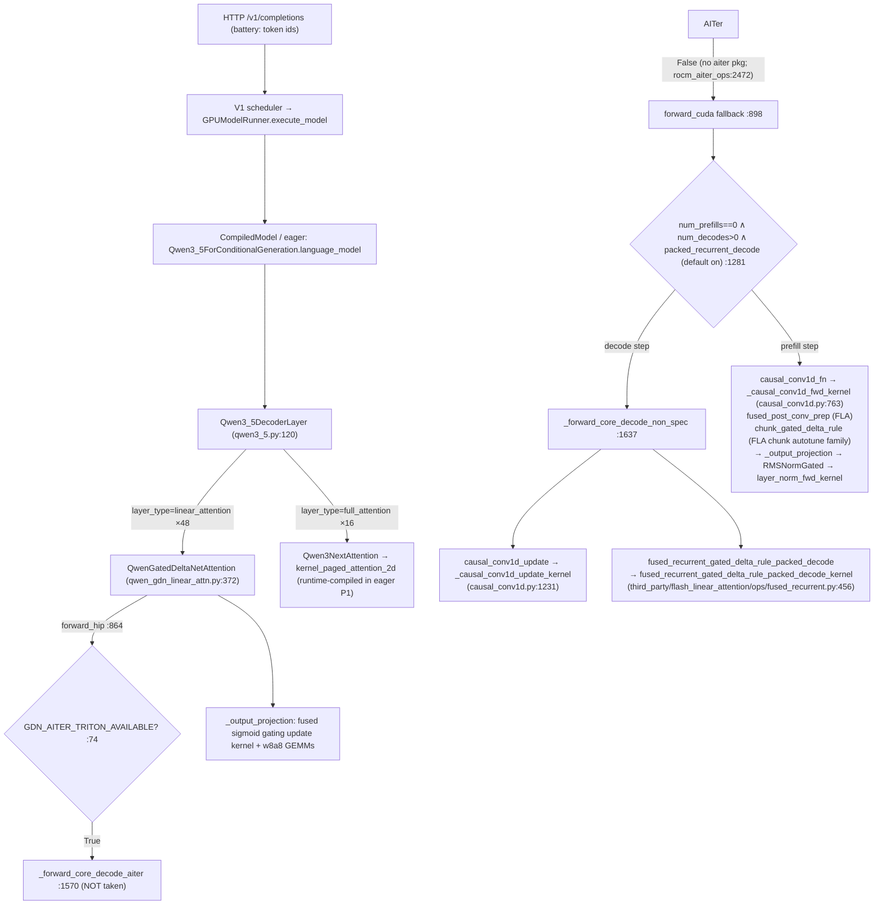

# 06 — Dynamic Call Graph (runtime-proven)

Built from: P1 runtime cache artifacts (which kernels actually ran/compiled
at first decode), P5 startup artifacts, source reading at pinned SHA
(file:line references), and platform detection values captured live
(`RocmPlatform`, `GDN_AITER_TRITON_AVAILABLE=False`, `gdn_decode_kernel`
auto-fallback cuda→triton, packed-recurrent decode on).

## Qwen3.8-27B-FP8 → GDN layer → generic ROCm path (live path at runtime)

Runtime evidence binding the graph:

- `_causal_conv1d_update_kernel` + `fused_recurrent_gated_delta_rule_packed_decode_kernel`
  compiled exactly at the FIRST decode request in P1 (mtime > battery t0;
  first-request 62.7 s) — proving the decode leg executes these wrappers.
- `layer_norm_fwd_kernel` compiled only during startup (3 variants, P1) —
  the output-projection RMSNorm leg was exercised by the startup profile
  run.
- `_w8a8_triton_block_scaled_mm` (6 variants in P5; 2 startup + 4 runtime in
  P1) — FP8 linear layers on all projection/MLP GEMMs.
- Full-attention leg: `kernel_paged_attention_2d` runtime-compiled at first
  decode in P1 (1 variant), covered by 2 startup variants in P5.

## Startup (timeline A) call sites producing the covering keys

- `GPUModelRunner` V1 profile/dummy run (full forward, max batched tokens)
  → prefill-side kernels + 2 w8a8 variants + 3 layer_norm variants
- `kernel_warmup.py:158 kernel_warmup(worker)` → `qwen_triton_warmup.py:284`
  (layer_norm warmup `warmup_layer_norm_fwd`, causal_conv1d_fn dummy,
  fused_post_conv lengths {1,2,16}, fused_sigmoid_gating update) +
  `mamba_triton_warmup.py` (batch_memcpy) — 104 compile keys
- cudagraph capture at sizes {1,2,4,...,512} → decode-leg kernels for every
  capture batch size (conv1d_update 6 variants = per-size specializations)
- jit monitor armed AFTER all of the above (`gpu_worker.py:1040`)
